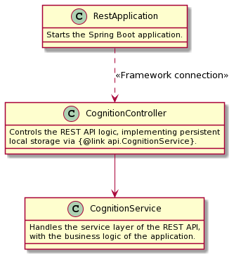
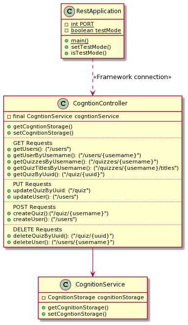

# API module (web server application)

## Description

The API uses the [Spring Boot](https://spring.io/projects/spring-boot) framework to create a web server with a REST API. Additionally, Spring Boot
has robust serialization and deserialization of _Plain Old Java Objects_ (POJOs),
using [Jackson](https://github.com/FasterXML/jackson) under the hood.

## Server for application logic and test logic

The Spring Boot web server can be started in _test mode_ or default mode. _Test mode_ runs on port `RestApplication.TEST_PORT` (at the time of writing: `3000`). Default mode runs on port `RestApplication.PORT` (at the time of writing: `8080`).

The `integration_tests` module starts a full Spring Boot server running on port used for testing. Else, a Spring Boot web server is started on the default port.

## REST server documentation

[Click here](src/main/asciidoc/index.adoc) to read the REST server documentation.

## Testing

[The tests in the `api` module](src/test/java/api) test the REST controller in isolation, in addition to the endpoints served by the Spring Boot web server.

Please see the JavaDoc in the respective tests for more documentation on the tests for the `api` module.

## Diagrams

The `abstract` diagram helps a new developer get an overview of the relationships and roles of each class before reading the `detailed` version, which in essence, is the more familiar way of drawing class diagrams. We choose this way of presenting the modules as it helps new developers to the project quickly understand the purpose of each class and how that comes into play in the broader task of the module.

### Abstracted

### Detailed

