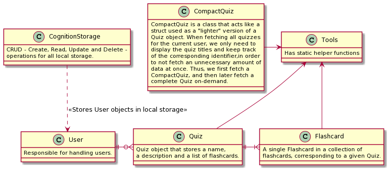
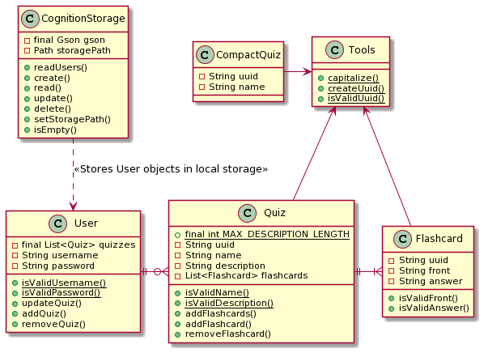

# Core module

## `core` package

The [`core`](src/main/java/core) package consists of plain old Java object (POJOs). These objects are responsible for
the business logic of Cognition.

For more documentation of each class in this package, please see their respective Javadoc. All classes are thoroughly
documented.

### The choice of not testing `CompactQuiz`

Please see the JavaDoc for the [CompactQuiz](src/main/java/core/CompactQuiz.java) for more information on **why** we use
this class.

In short: When fetching all quizzes for the current user, we only need to display the quiz titles and keep track of the
corresponding identifier, in order to not fetch an unnecessary amount of data at once.

We chose to not test this class, as it merely consts of a `UUID` and a `name`, with simple getter and setter methods.

We still deem the test coverage in the `core` module high enough.

## `json` package

### File stucture for local storage

The group have chosen JSON as the file format for storing data locally. The logic for this local file storage is located
in the [`json`](src/main/java/json) package in the `core` module.

The locally stored `.json` files are located at `~/it1901-gr2103/cognition`. This path is different for Unix and
Windows. If you are on a Unix system (Mac or Linux), you can use the following command in your terminal to navigate to
the locally stored data:

```sh
# If you are using Mac or Linux, navigate to the locally stored .json files
cd ~/it1901-gr2103/cognition

# Alternatively, if you are using Windows, use the collowing command to navigate
cd %HOMEPATH%\it1901-gr2103\cognition

# List all files in this directory
ls
```

Please note that you must adapt the path if you're using Windows.

We use different files for the application persistence and the persistence during testing. Concretely, `cognition.json`
is created for the application logic, whilst `cognitionTest.json` is created for testing.

### Storage Format

All application data is stored in the `cognition.json` file. The storage format is as follows:

```json
[
  {
    "quizzes": [
      {
        "uuid": "013f2844-9ad5-462f-b399-2aca21b66040",
        "name": "Quiz name",
        "description": "Quiz description",
        "flashcards": [
          {
            "uuid": "80b29cbc-3b65-4a0a-9eb2-a87ee8ab0e19",
            "front": "Who was the first president of the USA?",
            "answer": "George Washington"
          }
        ]
      }
    ],
    "username": "test-user",
    "password": "test-password"
  },
  ...
]
```

### Classes

The `json` package includes the class responsible for serializing Java objects to JSON data, and deserializing JSON data
into Java objects. [Gson](https://github.com/google/gson) is used to achieve this. Gson is a robust library for
converting Java objects into JSON data and vice versa, developed by Google.

[`CognitionStorage`](src/main/java/json/CognitionStorage.java) is responsible for persistently storing the plain old
Java objects in our application.

## Diagrams

The `abstract` diagram helps a new developer get an overview of the relationships and roles of each class before reading
the `detailed` version, which in essence, is the more familiar way of drawing class diagrams. We choose this way of
presenting the modules as it helps new developers to the project quickly understand the purpose of each class and how
that comes into play in the broader task of the module.

### Abstracted



### Detailed



> Please note that this diagram does not include getter and setter methods, as they are implicitly implemented if necessary. Additionally, getters and setters in diagrams offer little overview of the class functionality and its relationship to other classes.
