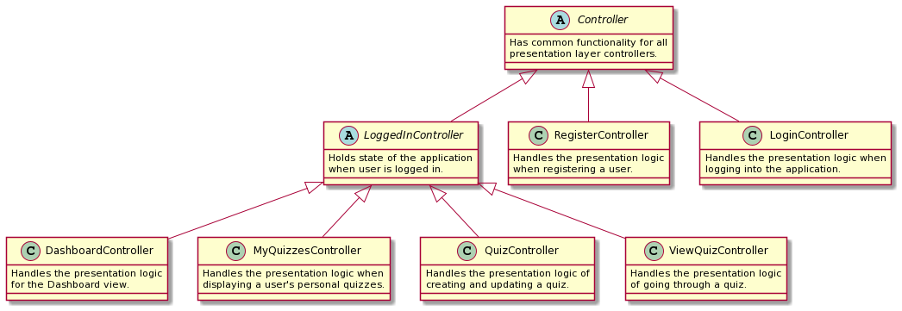
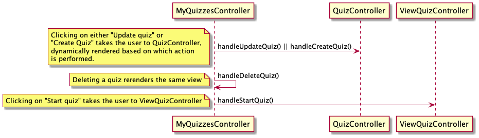

# UI module (client application)

The `ui` module handles the user interface of the app. It uses the library [JavaFX](https://openjfx.io/) to create an
interactive graphical interface.

## Group deliverable 1: Current functionality

So far, the user interface consists of a _Login_ view and a _Dashboard_ view with a `ListView` of stored flashcards.

As the complete user system has not yet been implemented, you sign in with the username "admin" and password "password".
If the user signs in with the correct credentials, they are redirected to the _Dashboard_ view. If the credentials are
not correct, they are prompted with an error message. The flashcards on the dashboard are read from a file stored at
local `~` directory (root directory).

> Please note that this has now been updated. The persistent data is now stored at `~/it1901-gr2103/cognition`.

This `ui` functionality works with the `core` functionality connected to the **user story** in
issue [#12](https://gitlab.stud.idi.ntnu.no/it1901/groups-2021/gr2103/gr2103/-/issues/12) on GitLab, i.e. persistent
storage. This issue is also one of our main user stories.

## Group deliverable 2: Current functionality

This sprint has seen lots of UI improvements.

As opposed to the last delivery, users are now able to both sign up and sign in to their user, enabled by persistent
storage. Therefore, we have added a _Register_ view in addition to the _Login_ view from the first delivery.

The _Dashboard_ view has been greatly improved by implementing several design elements from our Figma sketches. The _
Create Quiz_ view has also been designed in accordance with the Figma sketches.

There were a few challenges. For instance, being able to dynamically render a user's username on the _Dashboard_ view,
as the user is not yet set when the `initialize()` method is run in the `DashboardController`. The solution ended up
being to make the FXML `Text`
node `public`. We then access it and set it dynamically inside the `LoginController` before the scene is actually
rendered.

> Please note that this has now been updated. We now set the current user before rendering the relevant view, enabling us to use the `initialize()` method as usual. This is common for the entire application. This way, we do not have to implement any wonky work-arounds to the established JavaFX design principle of utilizing the `initialize()` method to render the initial view in a presentation layer Controller. Please see the [`goToDashboard(...)` method in the `LoginController`](src/main/java/ui/LoginController.java) for an example on how we switch view.

## Group deliverable 3: Current functionality

### Web application

Deliverable 3 turned the client application into a web
application. [`RemoteCognitionAccess`](src/main/java/ui/RemoteCognitionAccess.java) was implemented in the `ui` module
as the presentation layer REST accessor class that creates a bridge between the backend REST API and the frontend client
application.

As a result of this, the [presentation layer controllers](src/main/java/ui)
and [corresponding UI tests](src/test/java/ui) were refactored to use `RemoteCognitionAccess` to communicate with the
web server handling interaction with the persistent storage.

### The choice of not testing `RemoteCognitionAccess`

In order to test the client application in isolation, we use the [Mockito](https://site.mockito.org/) framework to mock the client application class that interacts with the web server: [`RemoteCognitionAccess`](src/main/java/ui/RemoteCognitionAccess.java). In other words, `RemoteCognitionAccess` is not explicitly tested in the `ui` module.

Rather, **we consider [`RemoteCognitionAccess`](src/main/java/ui/RemoteCognitionAccess.java) to be implicitly tested using the [`integration_tests`](../integration_tests) module. This is not registered by JaCoCo in the `ui` module**. It thus seems like [`RemoteCognitionAccess`](src/main/java/ui/RemoteCognitionAccess.java) is not tested, but that is not true.

Please read below for a version of the application that tests `RemoteCognitionAccess` using deployment tests, thus increasing its coverage in the `ui` module.

### Testing the UI

In the current `main` branch, the client application is tested in isolation; not dependent on a running web server. We achieved this by mocking [`RemoteCognitionAccess`](src/main/java/ui/RemoteCognitionAccess.java) and its returning values when testing.

However, **we have created a tag for a snapshot of the `main` branch with functional deployment testing**. This includes a starting a Spring Boot web server, and then testing all UI functionality against a running web server, not mocking any responses. Inspect the [`snapshot-ui-module-using-deployment-tests`](https://gitlab.stud.idi.ntnu.no/it1901/groups-2021/gr2103/gr2103/-/tree/snapshot-ui-module-using-deployment-tests) tag on GitLab. The root `README.md` has information on how to test the full-stack application, with a running client application and a running Spring Boot web server.

### Improvements and new functionality

Please see the [release 3 documentation](../../docs/release3/README.md) for more information on improvements and new
functionality in the `ui` module, specifically under the
heading `## Balancing implementing new functionality and ensuring code quality`.

## Diagrams

The `abstract` diagram helps a new developer get an overview of the relationships and roles of each class before reading the `detailed` version, which in essence, is the more familiar way of drawing class diagrams. We choose this way of presenting the modules as it helps new developers to the project quickly understand the purpose of each class and how that comes into play in the broader task of the module.

### Abstracted

### Detailed

> Please note that this diagram does not include getter and setter methods, as they are implicitly implemented if necessary. Additionally, getters and setters in diagrams offer little overview of the class functionality and its relationship to other classes.

## Sequence diagrams

An overview of the user flow between UI controllers can be found below.

### Login Sequence

### Dashboard Sequence

### MyQuizzes Sequence

