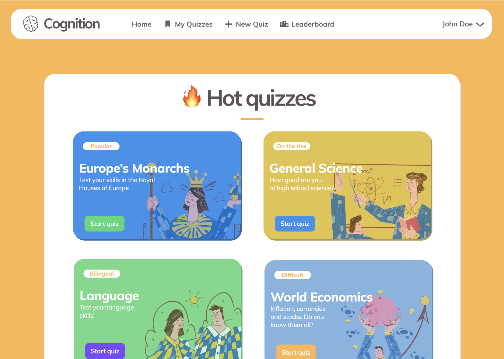
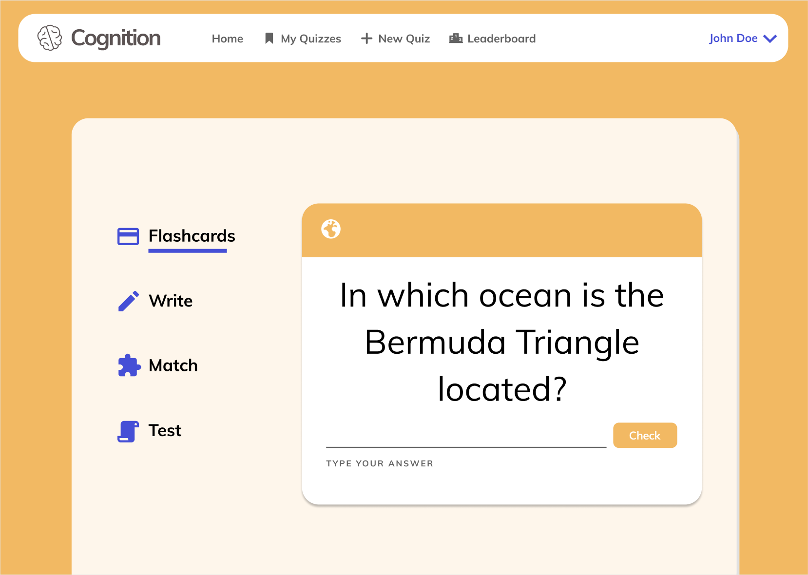
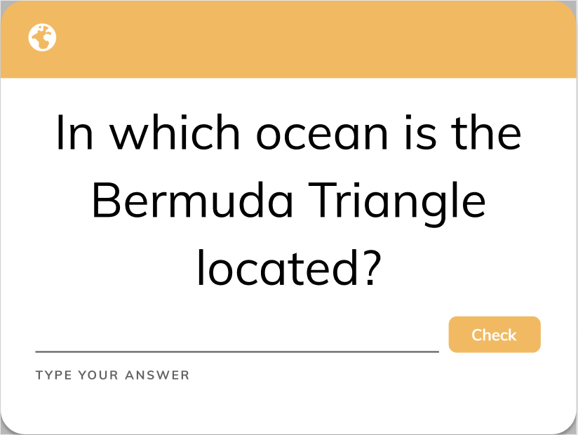
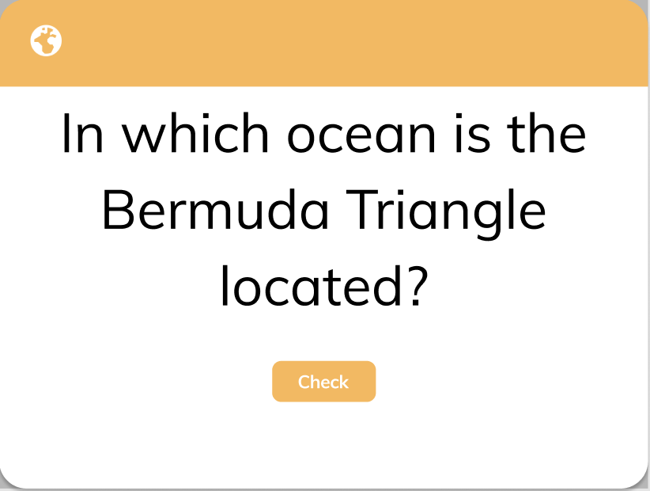
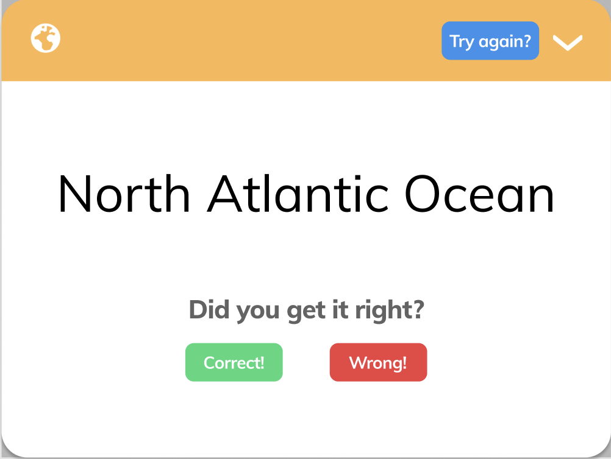

The following are mockup screenshots from our project Figma. The tentative design sketches can be
found [at this Figma link](https://www.figma.com/file/dlrynKyn3KHJIdElsM12CB/Cognition-Design?node-id=0%3A1).

### Login Screen

### Home Screen

#### Home Screen: Note at the end of deliverable 3

Notice how we did not include a leaderboard. This was not part of our improvements and future functionality, and were
deemed redundant in the final design by us.

Additionally, we updated the design on the _Dashboard_ view to have a welcoming message explaining the application.
The _My Quizzes_ view now displays your personal quizzes.

### Taking a Quiz

#### Taking a Quiz: Note at the end of deliverable 3

We did not implement different kinds of quizzes, e.g. _Write_ quizzes or _Match_ quizzes. This was not part of our
improvements and future functionality, and were deemed redundant in the final design by us.

### Flashcard - Type 1 (Input)

### Flashcard - Type 2 (Guess)

