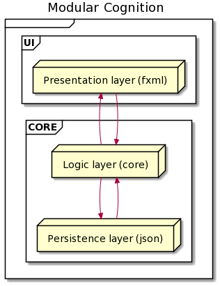
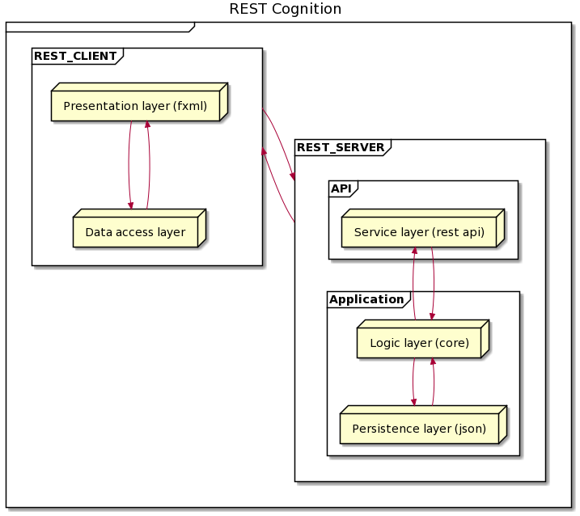
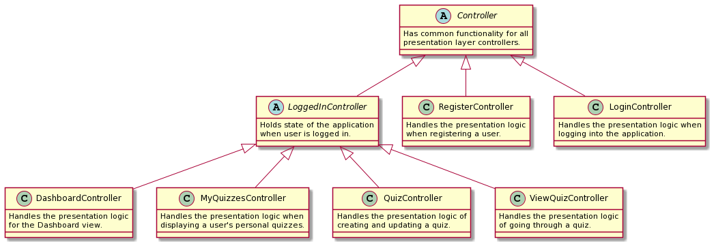
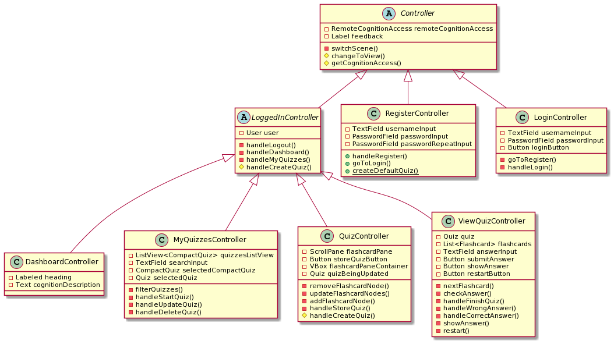
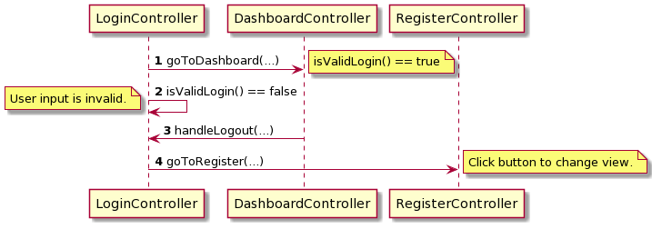
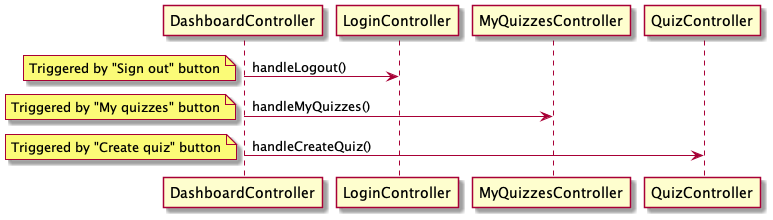
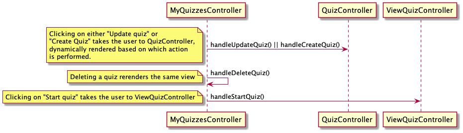

# Architecture Documentation

## Deliverable 2: The current architecture

The current architecture of the project is a 3-tier application that consists of a `ui` module and a `core` module. Note
that the `api` module exists, but has no real functionality. The `core` module is further divided into two layers; core
logic and persistent storage (JSON). This functionality is split into two Java packages: `core` and `json` respectively.

**Please note** that the current state has 2 modules (`ui` and `core`), but 3 conceptual layers (`ui`, `core/core`
, `core/json`), as explained above.

The user interface module (`ui`) consists of a presentation layer that communicates with the `core` module, specifically
the core logic layer (`core` package). This layer communicates with the persistence layer (`json` package) and then
sends the information back to the `ui`.

> Note that this is now updated. The client application stores data persistently by communicating with a web server using HTTP.

## Deliverable 3: The current architecture

The current architecture of the project is a 3-tier application, now consisting of a `ui` module, a `core` module and
an `api` module. The `core` module is further divided into two layers; core logic and persistent storage (JSON). This
functionality is split into two Java packages: `core` and `json` respectively.

The current architectural style of the Cognition application is a REST application. REST (_Representational State
Transfer_) applications use web services to communicate between the client and the REST server. Some constraints of this
type of architectural style are statelessness, cacheability, and layered system. The communication between the client
and the server is done with standard HTTP methods (e.g., `GET`, `POST`, `PUT`, `PATCH`, and `DELETE`).

In this case, the client application will consist of a presentation layer built with FXML and UI controllers, and a data
access layer that provides all functionality and data not located in the REST server. The client communicates with the
REST server via its API, and the API then communicates with the application tier of the server (`core` module). This
process functions backward to send data to the client application. This highly resembles the architecture of web
applications.

## Advantages of a 3-tier application

The modular architecture provides a set of advantages. For instance, the isolation of layers provides the opportunity to
change one layer without affecting other layers. Furthermore, when layers are separated by the part of the application
they handle, the code becomes more manageable, improving the project's workflow. Each layer can also be independently
tested. On the other hand, modular applications are a de-facto standard, well known by developers, making the
architectural choice modern and relevant and facilitating navigation through the codebase. Finally, a 3-tier application
can run quickly without much complexity.

## Disadvantages of a 3-tier application

There are, however, some disadvantages to a 3-tier application. It is possible that going through 3 layers only to
create one persistent record might be too complex. In addition, when all layers directly depend on a layer below, it is
not easy to swap out one layer with another one.

## Interaction between UI controllers

We have chosen to both model these relationships abstracted and detailed. This is done in order for a new developer to
get an abstracted overview of the relationships before reading the details of a UI controller.

### Abstracted

### Detailed

> This diagram does not show every function and variable in every class. Rather, it illustrates what we deemed important to get an overview of each class function and its relationship to the other classes.

Some of our controller have quite a bit of shared logic. Thus, we have abstracted this logic away from each extending
controller, and rather put all shared logic in abstract controller classes (e.g. `Controller`, `LoggedInController`).

The PlantUML diagram above goes into quite a bit of detail as to how each UI controller works, but we ask that you focus
on the main relationships between controllers. Note how all controllers extend the abstract `Controller`
class. `Controller` has all shared logic between controllers.

When the user logs in, some state is common for all UI controllers used when logged in. Thus, we have an
abstract `LoggedInController` that keeps all common functionality and state for all UI controllers active when the user
is logged in.

This decreases the amount of repeating code in our code base and ensures we abide to the **DRY principle (Don't Repeat
Yourself)**.

## Sequence diagrams

An overview of the user flow between UI controllers can be found below.

### Login Sequence

### Dashboard Sequence

### MyQuizzes Sequence

