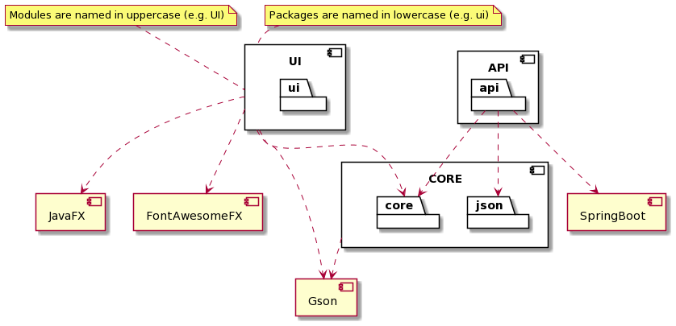
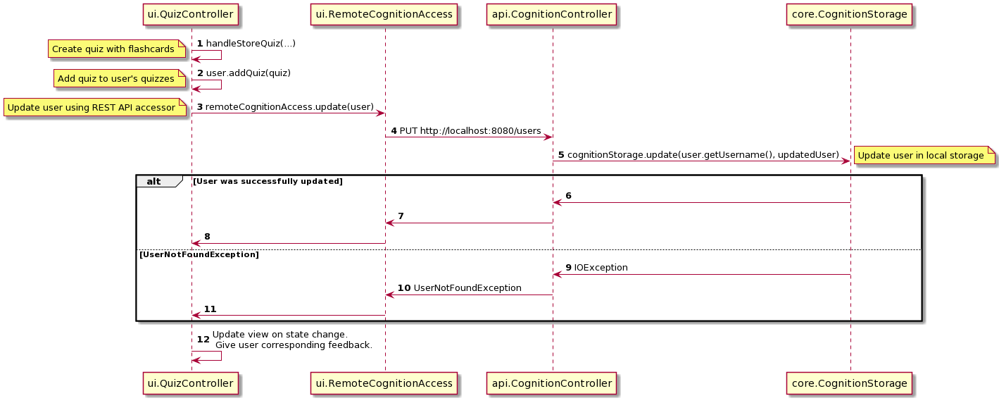

# Diagram documentation

## Architecture documentation

[Click here](../release2/ARCHITECTURE.md) to read the architecture documentation, with illustrating diagrams.

## Package documentation

This package diagram shows the dependencies of each module and package in the Cognition application.

**Please note that we have chosen to highlight runtime dependencies for each module.**

## Class diagram documentation

We have chosen to model the class diagrams for all modules in two different ways. The result is an `abstract`
and `detailed` version of each class diagram. The `abstract` diagram helps a new developer get an overview of the
relationships and roles of each class before reading the `detailed` version, which in essence, is the more familiar way
of drawing class diagrams. We choose this way of presenting the modules, as it helps new developers to the project to
quickly understand the purpose of each class and how that comes into play in the broader purpose of a given module.

Additionally, none of the `detailed` class diagrams include getter and setter methods, as they are implicitly
implemented if necessary. Additionally, getters and setters in diagrams offer little overview of the class functionality
and its relationship to other classes. For a more detailed explanation of each module, please navigate to the
documentation of the module.

### Core

#### Core: Abstracted

#### Core: Detailed

### API

#### API: Abstracted

#### API: Detailed

### UI

#### UI: Abstracted

#### UI: Detailed

## Sequence diagram documentation

### Creating a quiz

This sequence diagram shows the flow of creating a new quiz in the Cognition application.

