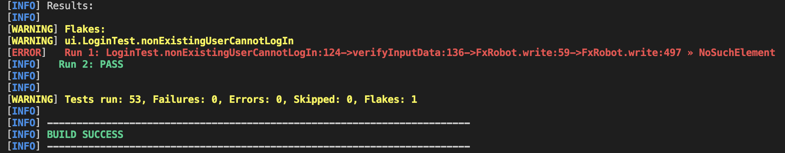

# Release 3

## Updated documentation in all modules

Please note that all prior documentation in all modules have been revised and updated.

### `ui` module documentation

[Click here](../../cognition/ui) to read the documentation for the `ui` module.

### `core` module documentation

[Click here](../../cognition/core) to read the documentation for the `core` module.

### `api` module documentation

[Click here](../../cognition/api) to read the documentation for the `api` module.

### `integration_tests` module documentation

[Click here](../../cognition/integration_tests) to read the documentation for the `integration_tests` module.

## Changelog from deliverable 2 to deliverable 3

Below, you can view a short summary of the changelog from deliverable 2 to deliverable 3:

### General

- Facilitate for packaging application, both UI and API
- Add `Makefile`, in order for each developer to run the application easier
- Shut down test server after tests are finished running using `Makefile`
- Update documentation

### The `ui` module

- Add functionality for displaying answer in the UI
- Enforce length checking in the `TextField` components in the UI
- Limit characters to only valid characters in the `TextField` components in the UI
- Filter quiz on user input
- Add functionality for restarting quiz
- Add REST accessor to act as middle-man between UI and
  API: [`RemoteCognitionAccess`](../../cognition/ui/src/main/java/ui/RemoteCognitionAccess.java)
- Update tests and application logic to
  use [`RemoteCognitionAccess`](../../cognition/ui/src/main/java/ui/RemoteCognitionAccess.java)
- Add default quizzes to each user, in order for the user to quickly use all available functionality in Cognition.
  See [`RegisterController`](../../cognition/ui/src/main/java/ui/RegisterController.java) for implementation detail.
- Add [`TestFxHelper`](../../cognition/ui/src/test/java/ui/TestFxHelper.java) for common methods used in all UI tests

### The `core` module

- Refactor validation of plain old Java objects
- Add new model: [`CompactQuiz`](../../cognition/core/src/main/java/core/CompactQuiz.java)
- Add enum for user validation: [`UserValidation`](../../cognition/core/src/main/java/core/UserValidation.java)

### The `api` module

- Add Spring Boot web server
- Add REST controller
- Add tests
  - Add REST controller test
  - Add endpoint test
- Add functionality for autogenerating documentation of the REST application

### The `integration_tests` module

- Add `integration_tests` module
- Test that client application can communicate with running Spring Boot web server

## Feedback from deliverable 2

### Refactoring and cleaning up local storage

As pointed out in the feedback we received on the second deliverable, we realized that we did not fully utilize the
potential of the abstract class `Storage` and `Storable` interface. Hence, we decided to move the logic of the `Storage`
class into [`CognitionStorage`](../../cognition/core/src/main/java/json/CognitionStorage.java), and deleted `Storable`
and `Storage` entirely.

For the `cognition` code base, we see this as a cleaner solution, as we only need a single class for persistent storage.

### Overriding `toString()` and testing

The feedback for deliverable 2 stated that our `toString()` methods in our Java models (
i.e. [`User`](../../cognition/core/src/main/java/core/User.java)
, [`Quiz`](../../cognition/core/src/main/java/core/Quiz.java)
and [`Flashcard`](../../cognition/core/src/main/java/core/Flashcard.java)) could not guarantee a given format.

All the `toString()` methods in our Java models are overridden using the `@Override` annotation with a deterministic
String representation.

Although testing these methods may seem redundant and bloated, we test these `toString()` methods in order to increase
test coverage.

### Tests irregularly failing in GitPod

The feedback for deliverable 2 stated that some tests in the `ui` module fail in GitPod. We have noticed the same
pattern. The tests in question are always changing, with `NoSuchElementException` being the exception thrown by TestFX.

The UI tests fail in GitPod when testing the process of switching between views. When switching views, UI components are
required to render before the tests can pass successfully. Due to latency issues in GitPod, some JavaFX components do
not have time to load before the tests execute.

**This error never happens locally**.

#### Attempts to fix this issue

We tried solving this by pinpointing the failing tests in question, and then waiting for JavaFX events before
interacting with the UI in the tests. This did not solve the issue of latency in GitPod. We even tried to sleep for a
hard-coded amount of seconds between each interaction with the view. This did also not solve the problem of latency
issues in GitPod.

Please see the [`TestFxHelper`](../../cognition/ui/src/test/java/ui/TestFxHelper.java) in the `ui` module for more
information about how we wait for FX events before continuing tests. Additionally, please
inspect [the tests in the `ui` module](../../cognition/ui/src/test/java/ui) to see
how [`TestFxHelper`](../../cognition/ui/src/test/java/ui/TestFxHelper.java) is used to wait for nodes.

After putting this much effort into achieving consistently passing tests in GitPod **using a method inspired by the
IT1901 staff**, with some UI tests still failing occasionally, we deemed other tasks more important to finish. Hence,
this issue was less prioritized at the end of deliverable 3.

**We encourage you to run the UI tests locally.**

#### Fixing the issue

In order to fix this issue, we read the [Maven Surefire documentation](https://maven.apache.org/surefire/maven-surefire-plugin/examples/rerun-failing-tests.html) and found that tests can be re-run using Maven Surefire.Thus, we added the `<rerunFailingTestsCount>1</rerunFailingTestsCount>` to all relevant `pom.xml` files. When `rerunFailingTestsCount` is set to a value larger than `0`, the output xml of the test report will also be extended to include information of each re-run. Please read the Maven Surefire documentation for more information about re-running failing tests.

A test that fails on its first run will be considered **flaky** by Surefire, and will be re-run. The developer is informed about a flaky test in the terminal. If the developer sees something along the lines of the following...

```sh
...

Run 1: FAIL
Run 2: PASS

...
```

...then this should be considered as a test passing.

_The following image is a screenshot from a flaky test in GitPod. It failed on its first run, but was re-run, and passed on its second run._



**We see this as a good workaround in order for tests to pass in GitPod, considering we have little to no power to control the latency issues occuring in GitPod.**

### UUID

We got feedback on the usage of UUID in the `User` class, as `username` is unique per user. We agree on this and
refactored the codebase to use `username`.

For `Quiz` and `Flashcard`, we still use UUID as we do not want to force uniqueness in the quiz name and flashcard name.
We feel that this is a clean solution which makes for a good developer experience.

### Encapsulation

We got multiple comments on encapsulation problems of lists throughout the code base. One of these was getters that
returned internal lists, which we resolved by returning new lists with the same contents. The `Controller` class also
had three methods that we changed to `private`.

## Reflection

### Refactoring local storage

Taking a chronological view on the progress of our project, we
added [`CognitionStorage`](../../cognition/core/src/main/java/json/CognitionStorage.java), the abstract `Storage` class
and the `Storable` interface at the same time. For deliverable 1 and 2, we went on interacting with the local storage
using only the `CognitionStorage` class, not utilizing the full potential of the hierarchy we had sketched out. This
class hierarchy would have been more fitting if we had several implementing storage classes, but there was no need for
this, due to the nature of our Java models and
the [file format defintion found in the core module documentation (`### Storage Format`)](../../cognition/core/README.md)
.

In hindsight, we should have started with only the `CognitionStorage` class, and then later improved on the persistence
solution. **That is more akin to agile software development**; continuously improving upon a working solution.

### Integration tests and deployment tests

#### Integration tests

Integration testing is a widely used term when talking about testing functionality across multiple modules. Some
understand the term as the different modules interacting in a full-fledged version of the full-stack application. Others
understand integration testing as simply verifying that the modules correctly interacts with each other, leaving details
to each module. This approach is sometimes called systems testing.

**The `integration_tests` module tests the latter scenario, leaving details to be tested by the `api`, `core` and `ui`
module.**

Please see the [`integration_tests`](../../cognition/integration_tests/README.md) documentation for more information
about this module.

#### Deployment tests

The former understanding of integration testing - "different modules interacting in a full-fledged version of the
full-stack application" - is sometimes referred to as deployment testing. The group has also developed a version where
the full-stack application is tested in this manner.

First, some context. Throughout the project, there has been a lot of back-and-forth regarding how to test the `ui`
module. The solution for some time was to spin up a Spring web server beforehand, and then test `ui` given that a web
server was running. This was achieved using a
custom [`Makefile` found in the `cognition` directory](../../cognition/Makefile).

We later moved to test `ui` in isolation, and rather have an additional module called `integration_tests`, in order to perform integration tests with a running client application and a web server.

However, our initial solution for testing `ui` given a running Spring Boot web server is really a deployment test, based on information provided by the IT1901 staff.

**We do not want this test functionality to go to waste, but it does not really fit in our `main` branch.** Thus, we have decided to tag the `main` branch at the moment when the `ui` module used deployment tests, rather than testing the client application functionality in isolation. The tag [`snapshot-ui-module-using-deployment-tests`](https://gitlab.stud.idi.ntnu.no/it1901/groups-2021/gr2103/gr2103/-/tree/snapshot-ui-module-using-deployment-tests) tag is available on GitLab with explaining documentation.

**Please note that this tag of the `main` branch excludes the `integration_tests` module, as the two approaches have quite fundamentally different setups in the `api` module and consequently the Spring Boot configuration.**

#### An alternative approach

Let's take a moment to reflect on a different approach, and why we deem this less fitting in a multi-modular Maven project.

We could have easily made `ui` depend on `api`. `ui` would then be able to simply call `RestApplication.main(...)` on test startup and `RestApplication.stop()` on test shutdown, or something similar. This would allow us to keep UI unit tests and integration tests in the same module (`ui`). However, this would introduce a **very unnecessary** dependency. The client application should really have no relation to the running web server. It should simply assume that some actor has the web server running on a machine, and act accordingly.

#### In summary

The `main` branch should test, **and currently is testing**, `api`, `core` and `ui` in isolation. Additionally, we have a module called `integration_tests` for testing connections between the client application and web server. The integration tests do not test many deatils in neither the `ui` module or the `api` module. This is tested in the respective modules. Rather, `integration_tests` verify that a client application view can successfully connect to the web server. You can find the deployment tests with explaining documentation in the [`snapshot-ui-module-using-deployment-tests`](https://gitlab.stud.idi.ntnu.no/it1901/groups-2021/gr2103/gr2103/-/tree/snapshot-ui-module-using-deployment-tests) tag on GitLab.

### Commit Culture

During deliverable 3, we put a great focus on the commit culture when contributing to our code base. Please
see [CONTRIBUTING](../../CONTRIBUTING.md) for more information on contributing to the code base.

Throughout deliverable 1 and 2, we practised our own guideline on how to commit code to our code base. This is inline
with the group contract formulated at the start of the project. The majority of these commits were only commit titles;
rarely descriptions and footers. This was sufficient for the four of us in the group, but **we recognize that this is
not sustainable for new developers** contributing to the code base.

Thus, we put more effort into every single commit during deliverable 3. Our commit messages now have a category (
e.g. `feat`, `fix`, `docs`, etc...), title, an optional description with **why** this change is needed, and a reference
to the issue to resolve. Branch names are clear and concise, and is to be marked with the ID number of the issue it
resolves. Example: `#10/feat-frontend`.

### Public methods in REST controller

In `CognitionController`, we have intentionally left all route functions as `public`, even though the server technically
won't break if they are `private`. We have done this for three reasons:

1. The methods are logically `public`, as they are used when `ui` sends HTTP requests to it.
2. The class is not being instantiated anywhere, and therefore the access modifiers do not matter
3. It makes it possible to unit test them

**Public route methods are also the convention in Spring Boot**, so doing this another way would confuse someone
familiar with Spring Boot.

### Component Based UI

After working with multiples FXML views, we realized that it would be convinient to separate some parts of the code into
components that could be imported into the main views of our projects. Specifically, 4 of our views include a navigation
bar that is identical in all of the views. Making this part of the code a component would not only make the current FXML
views easier to read, but it would also facilitate modifing the component as well as guarantee that the navigation bar
is identical in all views.

However, when trying to implement this change we stumbled into a problem. The `FXMLLoader` (a class that loads the
object hierarchy from an XML document) expects a **parameterless constructor** when initializing a controller
with `fx:include`. `fx:include` is how you are able to import the external fxml file. This problem makes the creation of
a navigation bar component difficult, as all the links in the navigation bar call functions that require a
specific `User`. This `User` is only accesible because the FXML Controller is constructed with it as a parameter.

In this case, we opted to not create a component based UI, as it would require modificating several parts of our code
base. In this case, we **suffer from technical debt**, in the sense that we commited to a solution that is hard to
modify without putting in more effort than what we deemed as efficient.

### The choice of not testing `CompactQuiz`

[Click here](../../cognition/core/README.md) to why we chose not to test the `CompactQuiz` class.

## REST server documentation

[Click here](../../cognition/api/src/main/asciidoc/index.adoc) to read the REST server documentation.

## Diagram documentation

[Click here](./DIAGRAMS.md) to view the documentation for various diagrams.

## `RemoteCognitionAccess`: The middle-man between `ui` and `api`

[`RemoteCognitionAccess`](../../cognition/ui/src/main/java/ui/RemoteCognitionAccess.java) is the middle-man between `ui`
and `api`; the class responsible for handling HTTP queries between classes in the `ui` module and the `api` module.

## Updating the way a developer runs the application (using `make`)

When finishing deliverable 2 of this project, you could install dependencies and test the application
using `mvn clean install`. If that command built successfully, you could run the application
using `cd ui && mvn javafx:run`.

For deliverable 3, we converted the application to interact with a web server using the Spring Boot framework. This
demanded that we reworked how the tests and the application is run, as there are more moving parts currently.

This led us to streamline the process of testing and running the application. Hence, we
added a [`Makefile`](../../cognition/Makefile) as a wrapper for the needed `mvn` commands to improve the quality of life
for the current developers and "future" developer (the one grading this project). **We underline that we still use Maven
for building the application.** `Make` simply acts as an abstraction above the existing `mvn` commands.

Please see the root [`README`](../../README.md) for more information on running the application, preferably using `make`.

**TL;DR** - You can now run tests using `make test` and run the application using `make` in the `cognition` directory.

## Default quizzes

Previously, new users started with no quizzes. Now, every new user is created with a standard introductory quiz. By
doing this, the user can now quickly use all available functionality in Cognition immediately after registering.

We struggled a bit with where this logic should be located. First, we thought about putting it in the `core` module, as
this module is where the logic for writing new users to file is located. We eventually ended up putting it in the `ui`
module, specifically in the `RegisterController` class. The introductory quiz is now added client-side when the user is
to be registered.

## Balancing implementing new functionality and ensuring code quality

After finishing deliverable 2, the Cognition application was a working minimum viable product (MVP). Due to an extended
deadline for deliverable 2, the group had time to add the following extra functionality:

- Filter quizzes based on user input.
  See [`MyQuizzesController`](../../cognition/ui/src/main/java/ui/MyQuizzesController.java) for implementation detail.

Throughout the milestones for deliverable 3, the group has added the following extra features:

- Improve user experience when navigating through a quiz. The user can now get some help along the way, and see how many
  correct answers the user got when finished with the quiz.
  See [`ViewQuizController`](../../cognition/ui/src/main/java/ui/ViewQuizController.java) for implementation detail.

- Add default quizzes to each user, in order for the user to quickly use all available functionality in Cognition.
  See [`RegisterController`](../../cognition/ui/src/main/java/ui/RegisterController.java) for implementation detail.

Furthermore, we have fixed suggested changes from deliverable 2.

We also felt the need to improve upon parts of our code base. This is in line with **agile development**; continuously
improving existing code in our code base. Specifically, we improved JavaDocs, updated access modifiers where it was
needed and increased readability in our code base.

**In summary, we feel that we struck a great balance between adding new functionality and improving code quality in our
code base.**
